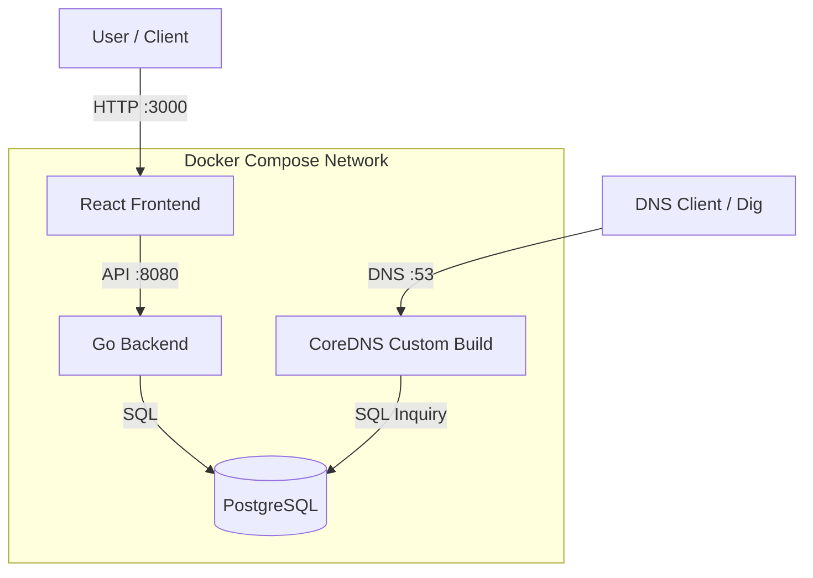

# LocalDNS Registrar System

This project is a **Full-Stack Local Domain Registrar**. It allows users to register domains (`.lan`, `.test`, etc.) and manage DNS records via a modern Web UI, with all changes reflected instantly in the local network DNS.

[View Changelog](CHANGELOG.md)

## 🏗 Architecture



## 🚀 Key Features
-   **Real-time DNS**: Updates to records (A, CNAME, etc.) are instantly available via CoreDNS `pdsql` plugin.
-   **User Management**: Multi-user support with authentication (JWT).
-   **Dashboard**: Manage domains and records in a responsive React UI.
-   **API First**: Everything is driven by a Go REST API.

## 👥 Roles & Permissions
The system supports two distinct roles:
1.  **Admin** (`role: admin`)
    -   Full access to the system.
    -   Can manage **all** domains and DNS records.
    -   Can view and manage users.
    > **Default Admin Credentials**:
    > -   **Username**: `admin`
    > -   **Password**: `admin123`

2.  **User** (`role: user`)
    -   Can only create and manage **their own** domains.
    -   Cannot see or modify other users' domains.

## 📚 API Reference (Swagger Support)
The following endpoints are currently supported:

### Authentication
| Method | Endpoint | Description | Auth Required |
| :--- | :--- | :--- | :--- |
| `POST` | `/api/register` | Register a new user | No |
| `POST` | `/api/login` | Login and retrieve JWT | No |

### Domains
| Method | Endpoint | Description | Auth Required |
| :--- | :--- | :--- | :--- |
| `GET` | `/api/domains` | List all domains (User sees own, Admin sees all) | Yes (JWT) |
| `POST` | `/api/domains` | Register a new domain | Yes (JWT) |
| `GET` | `/api/domains/:id` | Get domain details and records | Yes (JWT) |

### DNS Records
| Method | Endpoint | Description | Auth Required |
| :--- | :--- | :--- | :--- |
| `POST` | `/api/domains/:id/records` | Add a new DNS record (A, CNAME, etc.) | Yes (JWT) |

-   **Frontend**: React, Vite, TailwindCSS
-   **Backend**: Go (Golang), Gin, GORM
-   **Database**: PostgreSQL 15
-   **DNS**: CoreDNS (built with `pdsql` plugin)

## 🏁 Getting Started

### Prerequisites
-   Docker & Docker Compose

### Installation
1.  Clone the repository.
2.  Start the stack:
    ```bash
    docker-compose up --build -d
    ```
3.  Access the dashboard at [http://localhost:3000](http://localhost:3000).

### Usage
1.  **Register a User**: Create a new account on the login page.
2.  **Register a Domain**: Enter a domain name (e.g., `myserver.lan`) and click Register.
3.  **Add Records**: Click "Manage DNS" and add A records (e.g., pointing to `192.168.x.x`).
4.  **Test**:
    ```bash
    dig @localhost -p 53 myserver.lan
    ```

## 📂 Project Structure
```
.
├── backend/            # Go API Source
├── frontend/           # React UI Source
├── zones/              # (Legacy) Static zone files
├── docker-compose.yml  # Orchestration
├── Dockerfile.coredns  # Custom CoreDNS build
├── Corefile            # CoreDNS config
├── init.sql            # DB Schema
└── README.md           # This file
```
