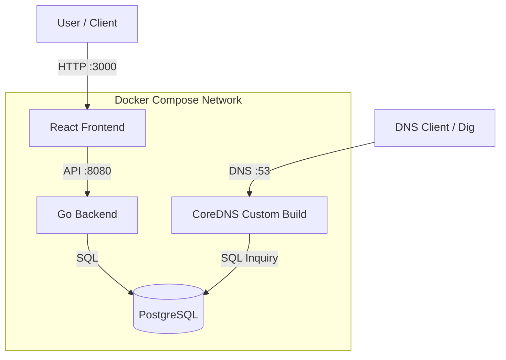

# LocalDNS Registrar System

This project is a **Full-Stack Local Domain Registrar**. It allows users to register domains (`.lan`, `.test`, etc.) and manage DNS records via a modern Web UI, with all changes reflected instantly in the local network DNS.

[View Changelog](CHANGELOG.md)

## 🏗 Architecture



## 🚀 Key Features
-   **Real-time DNS**: Updates to records (A, CNAME, MX, TXT, SRV, PTR, etc.) are instantly available via CoreDNS `pdsql` plugin.
-   **User Management**: Multi-user support with authentication (JWT) and role-based access control.
-   **Domain Registration**: Register local domains (`.lan`, `.test`, `.local`, `.home`, `.internal`) with automatic contact info inheritance.
-   **WHOIS Server**: Built-in WHOIS server (port 43) for domain information queries.
-   **Dashboard**: Manage domains and records in a responsive React UI with real-time updates.
-   **Contact Management**: User contact information automatically copied to domain registrant data for WHOIS.
-   **API First**: Everything is driven by a Go REST API.

## 👥 Roles & Permissions
The system supports two distinct roles:
1.  **Admin** (`role: admin`)
    -   Full access to the system.
    -   Can manage **all** domains and DNS records.
    -   Can view and manage users.
    > **Default Admin Credentials**:
    > -   **Username**: `admin`
    > -   **Password**: `admin123`

2.  **User** (`role: user`)
    -   Can only create and manage **their own** domains.
    -   Cannot see or modify other users' domains.

## 📚 API Reference (Swagger Support)
The following endpoints are currently supported:

### Authentication
| Method | Endpoint | Description | Auth Required |
| :--- | :--- | :--- | :--- |
| `POST` | `/api/register` | Register a new user | No |
| `POST` | `/api/login` | Login and retrieve JWT | No |

### Domains
| Method | Endpoint | Description | Auth Required |
| :--- | :--- | :--- | :--- |
| `GET` | `/api/domains` | List all domains (User sees own, Admin sees all) | Yes (JWT) |
| `POST` | `/api/domains` | Register a new domain | Yes (JWT) |
| `GET` | `/api/domains/:id` | Get domain details and records | Yes (JWT) |
| `DELETE` | `/api/domains/:id` | Delete a domain and all its records | Yes (JWT) |
| `PUT` | `/api/domains/:id/registrant` | Update domain registrant contact info | Yes (JWT) |

### DNS Records
| Method | Endpoint | Description | Auth Required |
| :--- | :--- | :--- | :--- |
| `GET` | `/api/domains/:id/records` | List all DNS records for a domain | Yes (JWT) |
| `POST` | `/api/domains/:id/records` | Add a new DNS record (A, CNAME, MX, TXT, SRV, PTR, etc.) | Yes (JWT) |
| `PUT` | `/api/records/:recordId` | Update a DNS record | Yes (JWT) |
| `DELETE` | `/api/records/:recordId` | Delete a DNS record | Yes (JWT) |

### Users (Admin Only)
| Method | Endpoint | Description | Auth Required |
| :--- | :--- | :--- | :--- |
| `GET` | `/api/users` | List all users | Yes (Admin) |
| `POST` | `/api/users` | Create a new user | Yes (Admin) |
| `PUT` | `/api/users/:id` | Update user (including contact info) | Yes (Admin) |
| `DELETE` | `/api/users/:id` | Delete a user | Yes (Admin) |

### Registrar Config (Admin Only)
| Method | Endpoint | Description | Auth Required |
| :--- | :--- | :--- | :--- |
| `GET` | `/api/config` | Get registrar configuration | Yes (JWT) |
| `PUT` | `/api/config` | Update registrar configuration | Yes (Admin) |

### WHOIS
| Method | Endpoint | Description | Auth Required |
| :--- | :--- | :--- | :--- |
| `GET` | `/whois/:domain` | Raw WHOIS response (text/plain) | No |
| `GET` | `/api/whois?domain=...` | WHOIS query via API | No |

-   **Frontend**: React, Vite, TailwindCSS
-   **Backend**: Go (Golang), Gin, GORM
-   **Database**: PostgreSQL 15 (using Docker named volumes)
-   **DNS**: CoreDNS (built with `pdsql` plugin)
-   **WHOIS**: Custom WHOIS server (Go)

## 🏁 Getting Started

### Prerequisites
-   Docker & Docker Compose

### Installation
1.  Clone the repository.
2.  Start the stack:
    ```bash
    docker-compose up --build -d
    ```
3.  Access the dashboard at [http://localhost:3000](http://localhost:3000).
4.  Login with default admin credentials:
    - Username: `admin`
    - Password: `admin123`

### Database Management
- Database data is stored in a Docker named volume (`postgres_data`).
- To completely reset the database:
  ```bash
  docker-compose down -v  # Removes containers and volumes
  docker-compose up -d     # Creates fresh database with init.sql
  ```
- Database schema is automatically initialized from `init.sql` on first startup.

### Usage
1.  **Register a User**: Create a new account on the login page (or use admin account).
2.  **Update Contact Info** (Optional): Edit your user profile to add contact information (used for domain WHOIS data).
3.  **Register a Domain**: Enter a domain name (e.g., `myserver.lan`) and click Register. Contact info is automatically copied from your user profile.
4.  **Add DNS Records**: Click "DNS" button and add records (A, CNAME, MX, TXT, etc.).
5.  **View WHOIS Info**: Click "WHOIS Info" button to view domain registration details.
6.  **Test DNS**:
    ```bash
    dig @localhost -p 53 myserver.lan
    ```
7.  **Test WHOIS**:
    ```bash
    whois -h localhost myserver.lan
    # or
    curl http://localhost:8080/whois/myserver.lan
    ```

## 📂 Project Structure
```
.
├── backend/            # Go API Source
│   ├── handlers/       # API handlers (auth, domain, whois)
│   ├── models/         # Database models (User, Domain, Record)
│   └── main.go         # Application entry point
├── frontend/           # React UI Source
│   └── src/
│       ├── pages/      # Dashboard, Login pages
│       └── ...
├── whois-server/       # WHOIS server (Go)
├── zones/              # (Legacy) Static zone files - no longer used
├── docker-compose.yml  # Service orchestration
├── Dockerfile.coredns  # Custom CoreDNS build with pdsql plugin
├── Corefile            # CoreDNS configuration
├── init.sql            # Database schema initialization
└── README.md           # This file
```

## 🔧 Configuration

### Database
- Database uses Docker named volumes for data persistence.
- Schema is defined in `init.sql` and automatically applied on first startup.
- GORM auto-migration handles schema updates on application startup.

### DNS
- CoreDNS listens on port 53 (UDP/TCP).
- Uses `pdsql` plugin to query PostgreSQL directly.
- Supports all standard DNS record types (A, AAAA, CNAME, MX, NS, TXT, SRV, PTR).

### WHOIS
- WHOIS server listens on port 43.
- Also accessible via HTTP at `/whois/:domain` and `/api/whois?domain=...`.
- Returns RFC 3912 compliant WHOIS responses.
